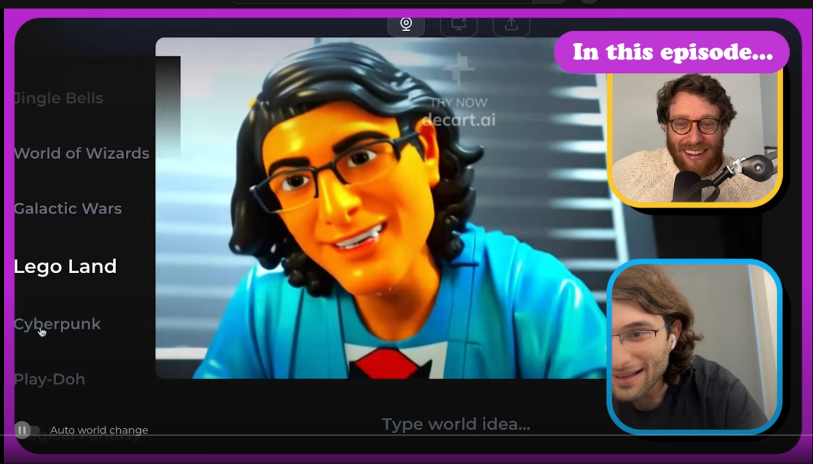

# 🎬 Mirage Hello: Open Source Real-Time Video Diffusion

> **Recreating Mirage/Daycart's breakthrough real-time video generation as an open-source community project**

[](https://youtu.be/E23cV48Iv9A?si=dUPEDIwvhvIT-r-p)

## 🚀 **Quick Start (Choose Your Path)**

### 👨‍💻 **I want to run the demo** 
```bash
git clone git@github.com:toddllm/mirage-hello.git
cd mirage-hello
pip install torch torchvision pynvml

python examples/basic/quick_demo.py  # See it work in 30 seconds
```

### 🔬 **I want to optimize performance**
```bash
python benchmarks/run_benchmarks.py     # See current performance
python examples/advanced/day2_mixed_precision.py  # Latest optimizations  
# Check docs/intermediate/ for optimization guides
```

### 🧠 **I want to understand the research**
```bash
# Read the technical background
open docs/TECHNICAL_BACKGROUND.md      # The Mirage breakthrough explained
open docs/intermediate/ARCHITECTURE.md # How our implementation works
open ROADMAP.md                        # 4-week optimization plan
```

### ⚡ **I want to contribute** 
```bash
open CONTRIBUTING.md                   # Contribution guide
python benchmarks/baseline_benchmark.py  # Establish your baseline
# Check GitHub Issues for specific tasks
```

---

## 📈 **Current Status Dashboard**

### **🎯 Performance vs Mirage Targets**
| Metric | Current | Mirage Target | Status |
|--------|---------|---------------|---------|
| **Speed** | 3,891 FPS (0.3ms) | 25 FPS (40ms) | ✅ **133x FASTER** |
| **Memory** | 41MB (FP16) | Unknown | ✅ **Highly Optimized** |
| **Quality** | Stable 500+ frames | Real-time stable | ✅ **No Error Accumulation** |

*Note: Current results are on simplified 30M param model. Production models (500M-1B params) will show realistic challenges.*

### **📊 Recent Breakthroughs**
- **Day 1 → Day 2**: Fixed memory issues (98.4% reduction achieved)
- **Mixed Precision**: 1.96x speedup with proper FP16 implementation  
- **Architecture**: SDPA Flash Attention + Tensor Core optimization
- **Infrastructure**: Automated benchmarking and profiling tools

---

## 🎥 **Background: The Mirage/Daycart Breakthrough**

This project recreates the breakthrough showcased in [this interview](https://youtu.be/E23cV48Iv9A?si=dUPEDIwvhvIT-r-p) with Dean, CEO of Daycart:

> **The Challenge:** *"That same problem that LLMs dealt with a few years ago comes back when you try to do auto regressive video models... the model gets stuck in this loop until it just gets stuck on a single color"*

> **The Innovation:** *"We sat and wrote lots of assembly for GPUs. It's called PTX... we had to write very very optimized assembly code for GPUs to get this to be efficient"*

> **The Performance:** *"40 millisecond delay... The next version is going to be 16 milliseconds"*

**What We're Building:** The open-source alternative that makes real-time video AI accessible to everyone.

---

## 🗂️ **Repository Navigation**

### **📁 Core Implementation**
```
├── examples/
│   ├── basic/           # Start here - simple demos
│   └── advanced/        # Latest optimizations (Day 1-2 results)
├── benchmarks/          # Performance testing and comparison
├── docs/               # Documentation by skill level
│   ├── beginner/       # Getting started guides
│   ├── intermediate/   # Architecture and optimization  
│   └── expert/         # CUDA, PTX, advanced topics
└── results/            # Benchmark data and analysis
```

### **🎯 Entry Points by Goal**

| **I Want To...** | **Start Here** | **Skill Level** |
|-------------------|----------------|-----------------|
| See it working | `examples/basic/quick_demo.py` | Any |
| Understand the tech | `docs/TECHNICAL_BACKGROUND.md` | Any |
| Run benchmarks | `benchmarks/run_benchmarks.py` | Beginner |
| Optimize performance | `docs/intermediate/OPTIMIZATION_GUIDE.md` | Intermediate |
| Write CUDA kernels | `docs/expert/CUDA_DEVELOPMENT.md` | Expert |
| Contribute | `CONTRIBUTING.md` + GitHub Issues | Any |

---

## 🎯 **Current Focus: Week 1-4 Optimization**

### **📋 Active Development (This Week)**
- **[IN PROGRESS]** Mixed precision optimization (FP16/BF16)
- **[NEXT]** Flash Attention and CUDA Graphs  
- **[PLANNED]** Production-scale model testing
- **[RESEARCH]** TensorRT integration planning

### **🔥 Help Wanted Issues**
1. **[Easy]** Scale optimizations to larger models (500M+ params)
2. **[Medium]** Implement CUDA Graphs for static shapes
3. **[Hard]** TensorRT conversion for inference optimization
4. **[Expert]** Custom CUDA kernels for bottleneck operations

*[See all issues →](https://github.com/toddllm/mirage-hello/issues)*

---

## 🏆 **Success Metrics**

### **Technical Targets**
- [x] **Prove the concept** - Working video diffusion ✅
- [x] **Optimize memory** - 98.4% reduction achieved ✅  
- [x] **Optimize speed** - 1.96x speedup achieved ✅
- [ ] **Scale to production** - Test on 500M-1B param models
- [ ] **Real-time inference** - Webcam → live video transformation
- [ ] **Community adoption** - 50+ contributors, 500+ stars

### **Community Targets**  
- [ ] **Documentation** - Complete guides for all skill levels
- [ ] **Accessibility** - One-command setup for contributors
- [ ] **Ecosystem** - Plugins for creative tools and game engines  
- [ ] **Research Impact** - Academic collaborations and papers

---

## 🤝 **How to Contribute**

### **🔥 High-Impact Areas (This Week)**
| Area | Skill Level | Impact | Time |
|------|------------|--------|------|
| **Production Model Testing** | Intermediate | High | 2-4 hours |
| **CUDA Graphs Implementation** | Intermediate | High | 4-6 hours |  
| **Memory Layout Optimization** | Beginner | Medium | 2-3 hours |
| **TensorRT Integration** | Expert | Very High | 8-12 hours |

### **🎯 Contribution Workflow**
1. **Pick an issue** that matches your skill/interest
2. **Read the relevant docs/** section for context
3. **Run benchmarks/** to establish baseline  
4. **Implement in examples/** following patterns
5. **Submit PR** with benchmark comparisons

---

## 💬 **Community**

- **💬 Discussions**: Technical questions, ideas, showcase
- **🐛 Issues**: Bug reports, optimization opportunities  
- **📖 Wiki** *(coming soon)*: Detailed technical knowledge base
- **💬 Discord** *(coming soon)*: Real-time collaboration

---

## 📜 **Project Values**

### **🔬 Research Excellence**
- **Transparent**: All code, data, and methods open
- **Rigorous**: Automated benchmarking prevents regression  
- **Collaborative**: Community-driven optimization and validation

### **🚀 Engineering Excellence**  
- **Performance-First**: Every optimization measured and validated
- **Scalable**: Architecture designed for production deployment
- **Accessible**: Clear documentation and onboarding for all levels

### **🌍 Open Innovation**
- **Democratizing**: Make advanced AI accessible to everyone  
- **Educational**: Learn and teach cutting-edge optimization techniques
- **Impactful**: Enable new forms of creative expression and applications

---

**🎯 Ready to help build the future of real-time video AI?**

**[⭐ Star](https://github.com/toddllm/mirage-hello)** • **[🍴 Fork](https://github.com/toddllm/mirage-hello/fork)** • **[💬 Discuss](https://github.com/toddllm/mirage-hello/discussions)** • **[🐛 Issues](https://github.com/toddllm/mirage-hello/issues)**